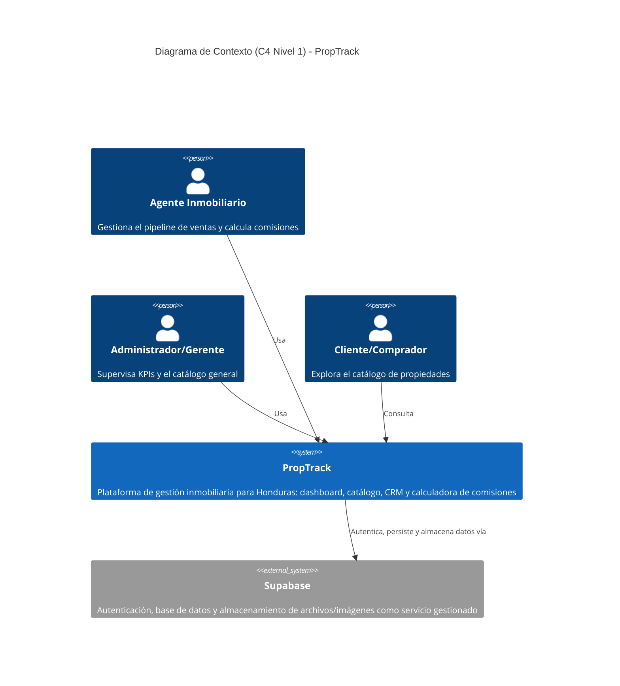

```mermaid
C4Context
    title Diagrama de Contexto (C4 Nivel 1) - PropTrack

    Person(agente, "Agente Inmobiliario", "Gestiona el pipeline de ventas y calcula comisiones")
    Person(admin, "Administrador/Gerente", "Supervisa KPIs y el catálogo general")
    Person(cliente, "Cliente/Comprador", "Explora el catálogo de propiedades")

    System(proptrack, "PropTrack", "Plataforma de gestión inmobiliaria para Honduras: dashboard, catálogo, CRM y calculadora de comisiones")

    System_Ext(supabase, "Supabase", "Autenticación, base de datos y almacenamiento de archivos/imágenes como servicio gestionado")

    Rel(agente, proptrack, "Usa")
    Rel(admin, proptrack, "Usa")
    Rel(cliente, proptrack, "Consulta")

    Rel(proptrack, supabase, "Autentica, persiste y almacena datos vía")
```
