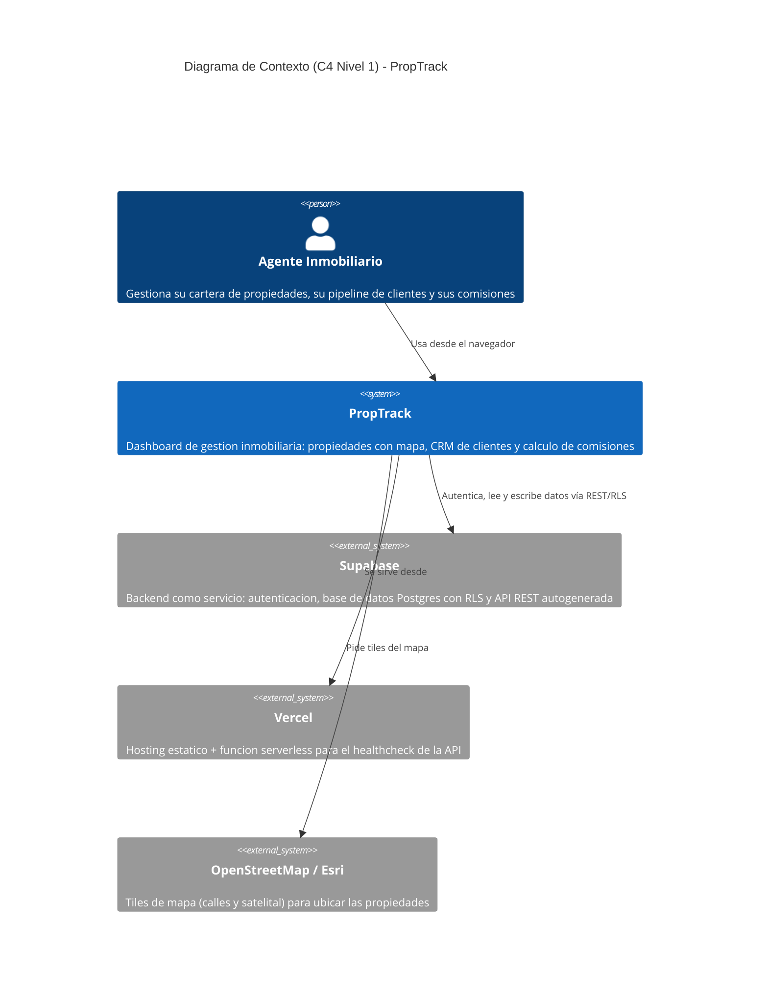
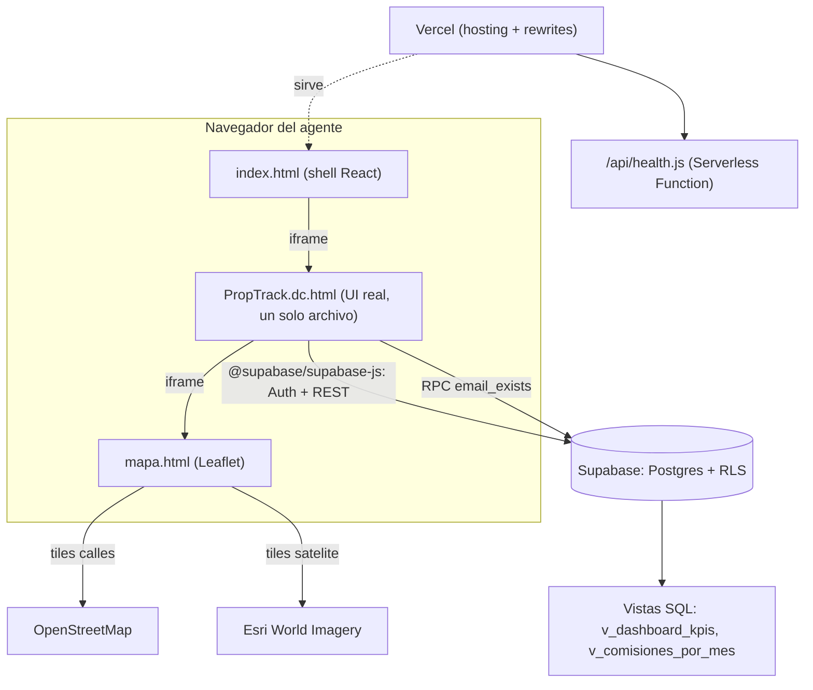

# Arquitectura de PropTrack

PropTrack es una app de gestión inmobiliaria (propiedades, clientes/pipeline
y comisiones) para agentes en San Pedro Sula, Honduras. Este documento
describe la arquitectura actual del sistema en producción.

## Diagrama de contexto (C4 · Nivel 1)

## Diagrama de contenedores (C4 · Nivel 2)

## Componentes principales

- **`index.html` / `src/App.jsx`**: shell de React que sólo monta un
  `<iframe>` a `PropTrack.dc.html`. Es el documento real servido en la
  raíz del dominio (`https://www.darielmencia.lat/`); ahí viven las
  etiquetas de SEO, Open Graph, manifest PWA y el registro del service
  worker.
- **`PropTrack.dc.html`**: la interfaz real de la aplicación (login,
  Resumen, Propiedades, Clientes, Comisiones). Ver [ADR-002](adr/ADR-002-frontend-prototipo.md)
  sobre por qué sigue siendo un solo archivo en vez de componentes React.
- **`mapa.html`**: mapa Leaflet embebido, recibe las propiedades del
  padre por `postMessage` (no tiene datos propios).
- **Supabase**: Postgres administrado con Row Level Security (cada fila
  scopeada a `user_id = auth.uid()`), Auth (email/password), y dos
  vistas (`v_dashboard_kpis`, `v_comisiones_por_mes`) que calculan los
  KPIs del dashboard como fuente única de verdad. Ver [ADR-001](adr/ADR-001-persistencia.md).
- **`supabase/migrations/`**: migraciones SQL idempotentes numeradas
  (`001_...`, `002_...`), aplicadas y registradas en
  `public.schema_migrations` por `supabase/migrate.js`.
- **Vercel**: hosting estático + rewrites (`/`, `/login`, `/admin` →
  `PropTrack.dc.html`) + una función serverless (`/api/health`).

## Decisiones de arquitectura (ADRs)

- [ADR-001 — Usar Supabase en vez de un backend propio](adr/ADR-001-persistencia.md)
- [ADR-002 — Mantener el prototipo de un solo archivo como frontend](adr/ADR-002-frontend-prototipo.md)
